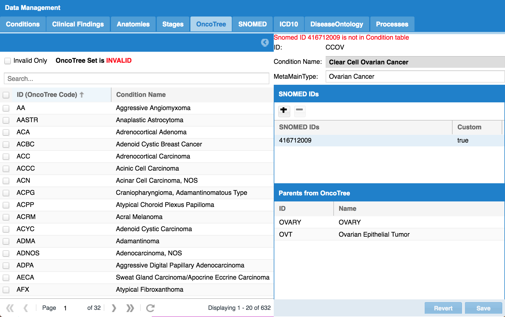
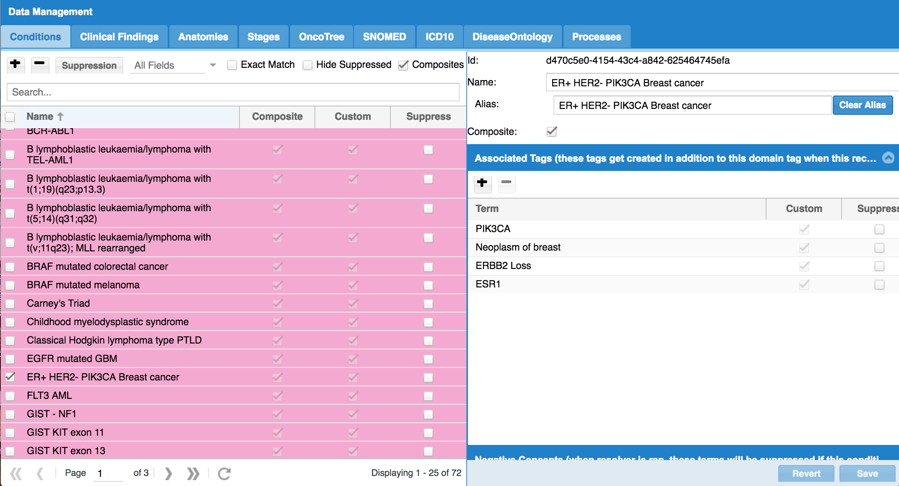
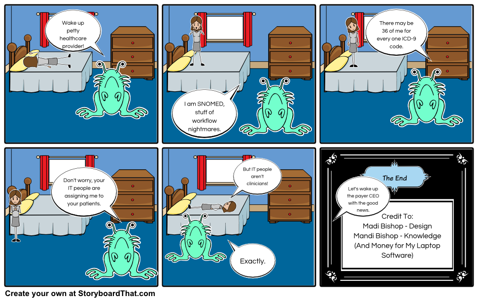

## MolecularMatch Conditions 2018 Update

In 2013, MolecularMatch integrated SNOMED-CT as our technology's primary condition (disease) dataset. For months and years after, oncologists and scientists at MM added a layer of curation so that it fits with modern cancer diagnoses. This included editing and adding new conditions and synonyms, and creating genetic composite conditions. Since then, SNOMED has improved in relation to oncology. Also, several open-source disease datasets have been launched. Matching patients to trials, drugs and assertion evidence guidelines depends on an accurate diagnoses and consistent interpretation between healthcare systems. Therefore in 2018, we upgraded our condition system, accomplishing the goals of:

1. Allowing cohesive code-based searching to improve EHR/Payer/LIMS integrations.
2. Updating to the most modern data ontologies.
3. Expanding operations outside of cancer.
4. Data validation (duplicates merging) with pathologist oversight.

---------

MolecularMatch NLP entity extraction and search engines run on ontologies. These include our conditions and findings, our in-house developed [molecular ontology](https://api.molecularmatch.com/#parentLevelMutations) and our global clinical trial aggregation. As our experience with data aggregation has grown, we've developed a protocol that allows for easy integration of big data to enhance our search engines. This high-level protocol is:

1. Acquire datasets in their native form on update intervals.
2. Identification strategy and merging to allow diverse inputs and avoid duplicates.
3. Incorporate into MMPower for broad use.

---------

#### Condition Data Incorporated into MM
Condition terms are now searchable by prefix_code (e.g. `SNOMEDID_12345`).

| Search Prefix | Dataset Name | Records Count |
|---|---|---|
| SNOMEDID | Systematized Nomenclature of Medicine -- Clinical Terms | **313,940** |
| ICD10 | 10th rev. of the International Statistical Classification of Diseases | **94,127** |
| DOID | DiseaseOntology -- open source medical vocabulary | **12,498** |
| ONCOTREE | OncoTree -- curated cancer type ontology by Memorial Sloan Kettering Cancer Center | **627** |

Additional datasets possibly worth integrating are: **ICD9** and **LOINC**. DiseaseOntology contains cross mapping of terms to MeSH, ICD, NCI’s thesaurus, SNOMED and OMIM.

All datasets can be easily updated on new releases. The current SNOMED-CT version is v20170901 U.S. edition.

---------

#### Dataset Mapping

We always design a feedback loop between clinical expertise and software automation. We do this by building easy to use, internal data management tools for training from M.D. and Ph.D. curators. This condition data upgrade required more than **100** M.D. pathologist curation hours.

Mapping efforts:

- ICD10 **→** SNOMED -- official mapping file used.
- OncoTree **→** SNOMED -- MolecularMatch pathologist manually mapped.
- DOID **→** SNOMED -- MolecularMatch pathologist manually mapped.

Screenshot of internal MM tools curators use to adjust mappings.
<!--  -->


---------

#### Custom Conditions and Genetic Composites

Only a handful of genetic composite conditions exist in the public datasets, like "EGFR positive NSCLC". At MM, we've created many more composites, which are necessary in our NLP engine for coalescing meaning from medical documents.

Screenshot of internal MM tools for creating composite conditions.
<!--  -->


---------

#### Lets Use It! (warning: not available on production yet)
These codes can now be used in the whole MM ecosystem. From the application search, to API queries, to EHR integration.

##### App Search

- http://app.molecularmatch.com/search/ICD10_D45
- http://app.molecularmatch.com/search/SNOMEDID_12345
- http://app.molecularmatch.com/search/DOID_0121
- http://app.molecularmatch.com/search/ONCOTREE_AML


##### API Queries
See specs on [api.molecularmatch.com](http://api.molecularmatch.com)

```
#################
# Trials Search -- save this as a .sh file
#################

# to run include apiKey as first argument
# $ chmod 777 file.sh
# $ ./file.sh apiKey

curl -X POST 'https://api.molecularmatch.com/v2/search/trials' \
--data "apiKey=$1" \
--data-urlencode 'filters=[ \
                  {"facet":"ICD10","term":"ICD10_D45"},  \
                  {"facet":"STATUS", "term":"Enrolling"}, \
                  {"facet":"TRIALTYPE", "term":"Interventional"} \
                  ]'

curl 'https://api.molecularmatch.com/v2/search/trials' \
--data "apiKey=$1" \
--data-urlencode 'filters=[ {"facet" : "SNOMEDID", "term" : "03387111"}]'
```

##### EHR Integration
Contact Us at <info@molecularmatch.com> for a demonstration of how to integrate with an EHR, payer system or LIMS.

---------

#### Mapping Trouble?
No mapping effort is perfect. Work with us to make sure you are getting the results you expect for your patients.


From: *http://healthstandards.com/blog/2014/04/21/snomed-problems/*
